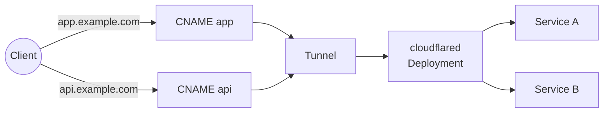
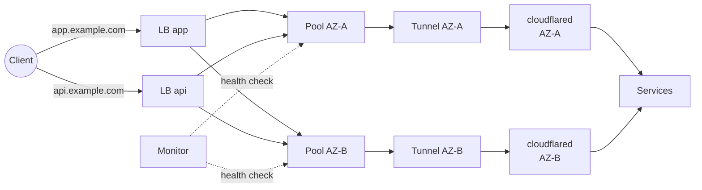
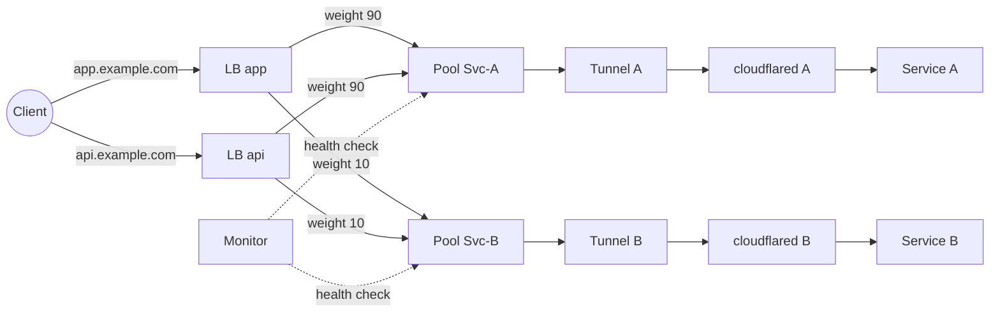
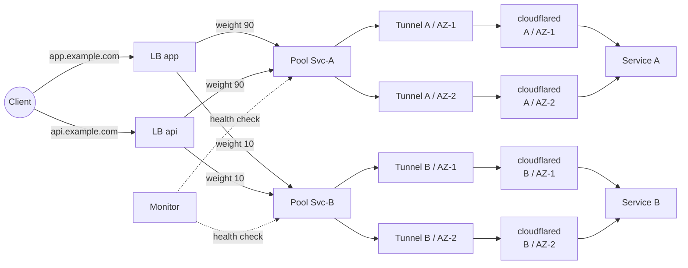

# cloudflare-gateway-controller


[](https://slsa.dev)


> The e2e tests for this project cost me $15 USD/month in Cloudflare Load Balancing fees.
> If you find it useful, please consider hitting the **Sponsor** button to help cover
> infrastructure costs.

A Kubernetes [Gateway API](https://gateway-api.sigs.k8s.io/) controller that manages
[Cloudflare Tunnels](https://developers.cloudflare.com/cloudflare-one/connections/connect-networks/)
and [Cloudflare Load Balancers](https://developers.cloudflare.com/load-balancing/) to expose
cluster services to the internet.

The controller watches `Gateway` and `HTTPRoute` resources and automatically provisions
Cloudflare tunnels, DNS records, and (optionally) load balancers to route external traffic
to Kubernetes services — no public IPs or `LoadBalancer`-type Services required.

## Topologies

The controller supports four deployment topologies, selected via the `CloudflareGatewayParameters`
CRD. The first topology works on Cloudflare's free plan. The other three require
[Cloudflare Load Balancing](https://developers.cloudflare.com/load-balancing/), which
includes 2 Endpoints (origins). Each additional Endpoint costs $5 USD/month.

| | Simple | High Availability | Traffic Splitting | TS + AZs |
|---|---|---|---|---|
| **Tunnels** | 1 | *A* | *S* | *S* x *A* |
| **LB Endpoints** | 0 | *A* | *S* | *S* x *A* |
| **Free plan** | Yes | No | No | No |
| **Extra API permissions** | None | LB (see below) | LB (see below) | LB (see below) |

> *A* = number of availability zones, *S* = number of unique Services in HTTPRoute backendRefs.

### 1. Simple (single tunnel + DNS)

The default topology when no `loadBalancer` is configured. A single Cloudflare tunnel handles
all traffic, and DNS CNAME records point each hostname directly to the tunnel. Multiple
HTTPRoutes can attach to the same Gateway — each hostname gets its own CNAME, and
cloudflared routes requests to the correct Service by hostname and path.



```yaml
apiVersion: cloudflare-gateway-controller.io/v1
kind: CloudflareGatewayParameters
metadata:
  name: example
spec:
  secretRef:
    name: cloudflare-creds
  dns:
    zone:
      name: example.com
```

**DNS:** The controller creates a CNAME record for each hostname declared in the attached
HTTPRoutes. Each CNAME points directly to the tunnel address (`<tunnelID>.cfargotunnel.com`).
When an HTTPRoute hostname is removed, its CNAME is deleted.

**Cloudflare resources:** 1 tunnel, 1 CNAME record per HTTPRoute hostname.

**Kubernetes resources:** 1 cloudflared `Deployment`, 1 tunnel token `Secret`.

**LB Endpoints:** 0 — works on the **free plan** with no additional cost.

**Best for:** Simple setups, development, single-cluster production with no HA requirements.

### 2. High Availability (multi-AZ + load balancer)

Deploys one cloudflared instance per availability zone. A Cloudflare Load Balancer is
created for each hostname and steers traffic between zones, while cloudflared handles
host- and path-based routing inside each tunnel. All hostnames share the same set of
AZ pools, so adding more HTTPRoutes does not increase the number of tunnels or endpoints.



```yaml
apiVersion: cloudflare-gateway-controller.io/v1
kind: CloudflareGatewayParameters
metadata:
  name: example
spec:
  secretRef:
    name: cloudflare-creds
  dns:
    zone:
      name: example.com
  tunnels:
    availabilityZones:
    - name: us-east-1a
      zone: us-east-1a               # shorthand for topology.kubernetes.io/zone
    - name: us-east-1b
      zone: us-east-1b
  loadBalancer:
    topology: HighAvailability
    steeringPolicy: Geographic       # route to closest AZ by client region
    monitor:
      path: /ready
```

**DNS:** No CNAME records are created. Instead, the controller creates a proxied Cloudflare
Load Balancer for each hostname declared in the attached HTTPRoutes. The LB itself acts as
the DNS entry for the hostname, resolving client requests and steering them to the
appropriate pool. When an HTTPRoute hostname is removed, its LB is deleted.

**Cloudflare resources:** 1 tunnel per AZ, 1 LB pool per AZ (1 origin each), 1 health
monitor, 1 load balancer per HTTPRoute hostname.

**Kubernetes resources:** 1 cloudflared `Deployment` per AZ (scheduled via pod placement
constraints), 1 tunnel token `Secret` per AZ.

**LB Endpoints:** *A* (one per AZ). Requires **Cloudflare Load Balancing**. Example: 2
AZs = 2 Endpoints (included), 3 AZs = 3 Endpoints (+$5/month for the extra one).

**Best for:** High availability across zones, geographic traffic steering, failover.

### 3. Traffic Splitting (per-service tunnels, no AZs)

Creates a separate tunnel for each Service referenced as a `backendRef` in HTTPRoutes.
A Cloudflare Load Balancer is created for each hostname and distributes traffic between
services using the weights from HTTPRoute `backendRef` entries. Multiple hostnames can
reference the same set of services — each gets its own LB, but they share the same pools,
so adding more hostnames does not increase the number of tunnels or endpoints.



```yaml
apiVersion: cloudflare-gateway-controller.io/v1
kind: CloudflareGatewayParameters
metadata:
  name: example
spec:
  secretRef:
    name: cloudflare-creds
  dns:
    zone:
      name: example.com
  loadBalancer:
    topology: TrafficSplitting
    steeringPolicy: Random           # distribute by weight
```

With an HTTPRoute like:

```yaml
apiVersion: gateway.networking.k8s.io/v1
kind: HTTPRoute
metadata:
  name: canary
spec:
  parentRefs:
  - name: my-gateway
  hostnames:
  - app.example.com
  rules:
  - backendRefs:
    - name: my-app-v1
      port: 80
      weight: 90
    - name: my-app-v2
      port: 80
      weight: 10
```

**DNS:** No CNAME records are created. Instead, the controller creates a proxied Cloudflare
Load Balancer for each hostname declared in the attached HTTPRoutes. The LB itself acts as
the DNS entry for the hostname, resolving client requests and distributing them across
per-service pools by weight. When an HTTPRoute hostname is removed, its LB is deleted.

**Cloudflare resources:** 1 tunnel per unique Service, 1 LB pool per Service (traffic
distributed by backendRef weights via the load balancer), 1 health monitor, 1 load
balancer per hostname.

**Kubernetes resources:** 1 cloudflared `Deployment` per unique Service, 1 tunnel token
`Secret` per unique Service.

**LB Endpoints:** *S* (one per unique Service). Requires **Cloudflare Load Balancing**.
Example: 2 Services = 2 Endpoints (included), 3 Services = 3 Endpoints (+$5/month).

**Limitation:** Traffic splitting happens at the load balancer level (before the request
reaches cloudflared), so path-based routing is not available within a traffic-split
hostname. If multiple rules for the same hostname reference different sets of `backendRef`
entries, the controller merges all services into a single weighted pool set.

**Best for:** Canary deployments, A/B testing, gradual rollouts.

### 4. Traffic Splitting with AZs (per-service + per-AZ)

Combines traffic splitting with AZ redundancy. Each Service gets a pool, and each pool has
origins in every configured AZ. As with the other LB topologies, each hostname gets its own
Load Balancer, and multiple hostnames share the same pools.



```yaml
apiVersion: cloudflare-gateway-controller.io/v1
kind: CloudflareGatewayParameters
metadata:
  name: example
spec:
  secretRef:
    name: cloudflare-creds
  dns:
    zone:
      name: example.com
  tunnels:
    availabilityZones:
    - name: us-east-1a
      zone: us-east-1a
    - name: us-east-1b
      zone: us-east-1b
  loadBalancer:
    topology: TrafficSplitting
    steeringPolicy: Random
    monitor:
      path: /ready
```

**DNS:** No CNAME records are created. Instead, the controller creates a proxied Cloudflare
Load Balancer for each hostname declared in the attached HTTPRoutes. The LB itself acts as
the DNS entry for the hostname, resolving client requests and distributing them across
per-service pools by weight, with each pool backed by origins in every configured AZ. When
an HTTPRoute hostname is removed, its LB is deleted.

**Cloudflare resources:** *S* x *A* tunnels, 1 LB pool per Service (with 1 origin per AZ),
1 health monitor, 1 load balancer per hostname.

**Kubernetes resources:** *S* x *A* cloudflared `Deployments` (scheduled via pod placement
constraints), *S* x *A* tunnel token `Secrets`.

**LB Endpoints:** *S* x *A* (one per Service per AZ). Requires **Cloudflare Load Balancing**.
Example: 2 Services x 2 AZs = 4 Endpoints (+$10/month for 2 extra), 3 Services x 3 AZs =
9 Endpoints (+$35/month for 7 extra).

**Best for:** Production canary deployments with zone-level redundancy.

## API Token Permissions

The Cloudflare API token stored in the `secretRef` Secret must have the permissions listed
below. All topologies require the base set. Load balancer topologies (HA, TS, TS+AZ) require
additional permissions.

**Base permissions (all topologies):**

| Permission | Scope | Purpose |
|---|---|---|
| Cloudflare Tunnel: Edit | Account | Create, configure, and delete tunnels |
| DNS: Edit | All zones | Create, update, and delete CNAME records |

**Additional permissions (HA, TS, TS+AZ):**

| Permission | Scope | Purpose |
|---|---|---|
| Load Balancing: Monitors And Pools: Edit | Account | Create and manage health monitors and origin pools |
| Load Balancers: Edit | All zones | Create and manage load balancers |

> **Note:** "Load Balancing: Monitors And Pools: Edit" (account-level) is a different
> permission from "Load Balancers: Edit" (zone-level). Both are required for load balancer
> topologies.
