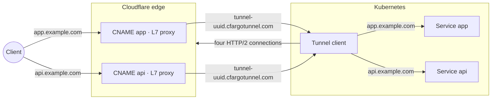

# cloudflare-gateway-controller


[](https://slsa.dev)


A Kubernetes [Gateway API](https://gateway-api.sigs.k8s.io/) controller that manages
[Cloudflare Tunnels](https://developers.cloudflare.com/cloudflare-one/connections/connect-networks/)
to expose cluster services to the internet.

The controller watches `Gateway`, `HTTPRoute`, and `GRPCRoute` resources and automatically
provisions Cloudflare tunnels and DNS records to route external traffic to Kubernetes
services — no public IPs or `LoadBalancer`-type Services required.

## How It Works

A single Cloudflare tunnel handles all traffic, and proxied CNAME records point each hostname
directly to the tunnel. Multiple HTTPRoutes and GRPCRoutes can attach to the same
Gateway — each hostname gets its own CNAME. The tunnel container embeds both cloudflared
and a reverse proxy to route requests to the correct backend Service by hostname, path,
and protocol, with per-request load balancing through kube-proxy.



The diagram above illustrates the topology for a single Gateway resource. A cluster can
have multiple Gateways, each will have its own tunnel client.

A minimal setup needs a credentials Secret, a GatewayClass, a Gateway, and an HTTPRoute —
no CloudflareGatewayParameters required. Credentials come from the GatewayClass
`parametersRef` Secret, and DNS management is enabled for all hostnames by default:

```yaml
apiVersion: v1
kind: Secret
metadata:
  name: cloudflare-creds
  namespace: default
stringData:
  CLOUDFLARE_API_TOKEN: "your-api-token"
  CLOUDFLARE_ACCOUNT_ID: "your-account-id"
---
apiVersion: gateway.networking.k8s.io/v1
kind: GatewayClass
metadata:
  name: cloudflare
spec:
  controllerName: cloudflare-gateway-controller.io/controller
  parametersRef:
    group: ""
    kind: Secret
    name: cloudflare-creds
    namespace: default
---
apiVersion: gateway.networking.k8s.io/v1
kind: Gateway
metadata:
  name: my-gateway
  namespace: default
spec:
  gatewayClassName: cloudflare
  listeners:
  - name: https
    protocol: HTTPS
    port: 443
---
apiVersion: gateway.networking.k8s.io/v1
kind: HTTPRoute
metadata:
  name: my-route
  namespace: default
spec:
  parentRefs:
  - name: my-gateway
  hostnames:
  - app.example.com
  rules:
  - backendRefs:
    - name: my-service
      port: 80
```

For more control, reference a CloudflareGatewayParameters to configure tunnel replicas
for high availability, vertical autoscaling, restrict DNS zones, and more:

```yaml
apiVersion: gateway.networking.k8s.io/v1
kind: Gateway
metadata:
  name: my-gateway
  namespace: default
spec:
  gatewayClassName: cloudflare
  listeners:
  - name: https
    protocol: HTTPS
    port: 443
  infrastructure:
    parametersRef:
      group: cloudflare-gateway-controller.io
      kind: CloudflareGatewayParameters
      name: my-params
---
apiVersion: cloudflare-gateway-controller.io/v1
kind: CloudflareGatewayParameters
metadata:
  name: my-params
  namespace: default
spec:
  tunnel:
    replicas:
      - name: us-east-1a
        zone: us-east-1a
      - name: us-east-1b
        zone: us-east-1b
      - name: us-east-1c
        zone: us-east-1c
    autoscaling:
      enabled: true
    resources:
      requests:
        cpu: 100m
        memory: 128Mi
      limits:
        cpu: "1"
        memory: 512Mi
  dns:
    zones:
      - name: example.com
      - name: other.com
```

See the [CloudflareGatewayParameters](docs/api/v1/CloudflareGatewayParameters.md) docs for
all options.

**DNS:** The controller creates a CNAME record for each hostname declared in the attached
routes (HTTPRoute and GRPCRoute). Each CNAME points directly to the tunnel address
(`<tunnelID>.cfargotunnel.com`). When a route hostname is removed, its CNAME is deleted.

**Cloudflare resources:** 1 tunnel, 1 CNAME record per route hostname.

**Kubernetes resources:** Per Gateway, the controller creates a tunnel Deployment,
a tunnel token Secret, a routes ConfigMap, a ServiceAccount, a Role, and a RoleBinding.

**Replicas:** Multiple named replicas can be configured per tunnel for high availability.
Each replica creates a separate Deployment with optional placement controls (zone,
nodeSelector, affinity). See
[CloudflareGatewayParameters](docs/api/v1/CloudflareGatewayParameters.md#replicas) for
configuration details.

**Deployment patches:** RFC 6902 JSON Patch operations can be applied to the cloudflared
Deployment for advanced customization (e.g. tolerations, node selectors). See
[CloudflareGatewayParameters](docs/api/v1/CloudflareGatewayParameters.md#patches) for
details.

**Container resources and autoscaling:** CPU and memory requests/limits are configurable
for the tunnel container. Vertical Pod Autoscaler (VPA) support is available for automatic
resource tuning. See
[CloudflareGatewayParameters](docs/api/v1/CloudflareGatewayParameters.md#tunnel-container-configuration)
for details.

**Token rotation:** The controller automatically rotates tunnel tokens every 24 hours by
default (configurable via
[CloudflareGatewayParameters](docs/api/v1/CloudflareGatewayParameters.md#token-rotation)).
On-demand rotation is also available via the CLI. Rotation updates the in-cluster Secret
and performs a rolling restart of the tunnel pods so they pick up the new token.

**Observability:** The controller creates a
[CloudflareGatewayStatus](docs/api/v1/CloudflareGatewayStatus.md) (short name: `cgs`) per
Gateway, providing a quick view of tunnel info, conditions, and managed resources:

```
$ kubectl get cgs
NAME         TUNNEL ID    DNS       READY
my-gateway   abcd-1234…   Enabled   True
```

### CLI

The `cfgwctl` CLI provides operational commands for managing Gateways. Binaries are
available from [GitHub releases](https://github.com/matheuscscp/cloudflare-gateway-controller/releases).

```shell
# Suspend/resume reconciliation
cfgwctl suspend gateway my-gateway
cfgwctl resume gateway my-gateway

# Trigger on-demand reconciliation
cfgwctl reconcile gateway my-gateway

# Rotate the tunnel token on-demand
cfgwctl rotate gateway token my-gateway
```

See the [CLI documentation](docs/cli/README.md) for all available commands.

### Embedded reverse proxy

The tunnel container embeds a reverse proxy that solves the load-balancing problem
with cloudflared's persistent connections. Without it, cloudflared opens a single
long-lived TCP connection to each backend Service, bypassing kube-proxy and pinning
all traffic to one pod.

The embedded reverse proxy receives all traffic from cloudflared and routes requests
by hostname, path prefix, and protocol (HTTP vs gRPC) to the correct backend Service.
HTTP requests use HTTP/1.1 with keep-alives disabled so every request opens a fresh
connection through kube-proxy for proper pod-level load balancing. gRPC requests use
HTTP/2 cleartext (h2c) to preserve streaming semantics. When a route rule has multiple
`backendRefs` with `weight` fields, the proxy distributes requests across backends
according to their weights (traffic splitting). The proxy also supports
[session persistence](docs/api/v1/HTTPRoute.md#session-persistence) via cookie-based
or header-based affinity to pin a client to the same backend across requests.

## API Token Permissions

The Cloudflare API token must have the following permissions:

| Permission | Scope | Purpose |
|---|---|---|
| Cloudflare Tunnel: Edit | Account | Create, configure, and delete tunnels in the account |
| DNS: Edit | Zone(s) | Create, update, and delete CNAME records in the zone(s) |
