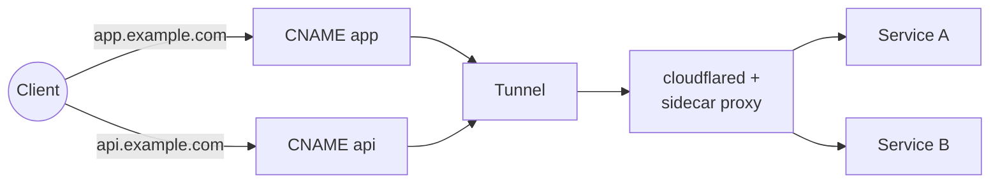

# cloudflare-gateway-controller


[](https://slsa.dev)


A Kubernetes [Gateway API](https://gateway-api.sigs.k8s.io/) controller that manages
[Cloudflare Tunnels](https://developers.cloudflare.com/cloudflare-one/connections/connect-networks/)
to expose cluster services to the internet.

The controller watches `Gateway` and `HTTPRoute` resources and automatically provisions
Cloudflare tunnels and DNS records to route external traffic to Kubernetes services — no
public IPs or `LoadBalancer`-type Services required.

## How It Works

A single Cloudflare tunnel handles all traffic, and DNS CNAME records point each hostname
directly to the tunnel. Multiple HTTPRoutes can attach to the same Gateway — each hostname
gets its own CNAME. A sidecar reverse proxy runs alongside cloudflared to route requests
to the correct backend Service by hostname and path, with per-request load balancing
through kube-proxy.



A minimal setup needs only a Gateway and an HTTPRoute — no CloudflareGatewayParameters
required. Credentials come from the GatewayClass `parametersRef` Secret, and DNS management
is enabled for all hostnames by default:

```yaml
apiVersion: gateway.networking.k8s.io/v1
kind: Gateway
metadata:
  name: my-gateway
spec:
  gatewayClassName: cloudflare
  listeners:
  - name: http
    protocol: HTTP
    port: 80
---
apiVersion: gateway.networking.k8s.io/v1
kind: HTTPRoute
metadata:
  name: my-route
spec:
  parentRefs:
  - name: my-gateway
  hostnames:
  - app.example.com
  rules:
  - backendRefs:
    - name: my-service
      port: 80
```

For more control, reference a CloudflareGatewayParameters to provide per-Gateway credentials
or restrict DNS management to specific zones:

```yaml
apiVersion: cloudflare-gateway-controller.io/v1
kind: CloudflareGatewayParameters
metadata:
  name: my-params
spec:
  secretRef:
    name: cloudflare-creds
  dns:
    zones:
    - name: example.com
```

See the [CloudflareGatewayParameters](docs/api/v1/CloudflareGatewayParameters.md) docs for
all options, including how to disable DNS management entirely.

**DNS:** The controller creates a CNAME record for each hostname declared in the attached
HTTPRoutes. Each CNAME points directly to the tunnel address (`<tunnelID>.cfargotunnel.com`).
When an HTTPRoute hostname is removed, its CNAME is deleted.

**Cloudflare resources:** 1 tunnel, 1 CNAME record per HTTPRoute hostname.

**Kubernetes resources:** Per Gateway, the controller creates a cloudflared Deployment
(with a sidecar proxy container), a tunnel token Secret, a sidecar ConfigMap (routing
table), a ServiceAccount, a Role, and a RoleBinding.

**Observability:** The controller creates a
[CloudflareGatewayStatus](docs/api/v1/CloudflareGatewayStatus.md) (short name: `cgs`) per
Gateway, providing a quick view of tunnel info, conditions, and managed resources:

```
$ kubectl get cgs
NAME         TUNNEL NAME   TUNNEL ID    DNS       READY
my-gateway   gw-a1b2c3…    abcd-1234…   Managed   True
```

### Sidecar reverse proxy

The sidecar proxy solves the load-balancing problem with cloudflared's persistent
connections. Without it, cloudflared opens a single long-lived TCP connection to each
backend Service, bypassing kube-proxy and pinning all traffic to one pod.

The sidecar receives all traffic from cloudflared on `localhost:8080`, routes requests
by hostname and path prefix to the correct backend Service, and disables HTTP
keep-alives on egress so every request opens a fresh connection through kube-proxy
for proper pod-level load balancing.

The sidecar is enabled by default. To disable it, set `config.sidecar.enabled: false`
in the Helm values.

## API Token Permissions

The Cloudflare API token stored in the `secretRef` Secret must have the following permissions:

| Permission | Scope | Purpose |
|---|---|---|
| Cloudflare Tunnel: Edit | Account | Create, configure, and delete tunnels |
| DNS: Edit | All zones | Create, update, and delete CNAME records |
