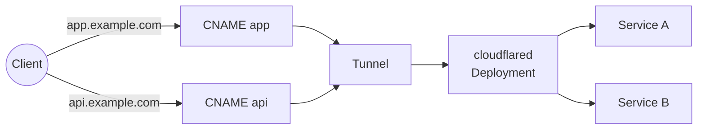

# cloudflare-gateway-controller


[](https://slsa.dev)


A Kubernetes [Gateway API](https://gateway-api.sigs.k8s.io/) controller that manages
[Cloudflare Tunnels](https://developers.cloudflare.com/cloudflare-one/connections/connect-networks/)
to expose cluster services to the internet.

The controller watches `Gateway` and `HTTPRoute` resources and automatically provisions
Cloudflare tunnels and DNS records to route external traffic to Kubernetes services — no
public IPs or `LoadBalancer`-type Services required.

## How It Works

A single Cloudflare tunnel handles all traffic, and DNS CNAME records point each hostname
directly to the tunnel. Multiple HTTPRoutes can attach to the same Gateway — each hostname
gets its own CNAME, and cloudflared routes requests to the correct Service by hostname and
path.



```yaml
apiVersion: cloudflare-gateway-controller.io/v1
kind: CloudflareGatewayParameters
metadata:
  name: example
spec:
  secretRef:
    name: cloudflare-creds
  dns:
    zone:
      name: example.com
```

**DNS:** The controller creates a CNAME record for each hostname declared in the attached
HTTPRoutes. Each CNAME points directly to the tunnel address (`<tunnelID>.cfargotunnel.com`).
When an HTTPRoute hostname is removed, its CNAME is deleted.

**Cloudflare resources:** 1 tunnel, 1 CNAME record per HTTPRoute hostname.

**Kubernetes resources:** 1 cloudflared `Deployment`, 1 tunnel token `Secret`.

Works on the **free plan** with no additional cost.

## API Token Permissions

The Cloudflare API token stored in the `secretRef` Secret must have the following permissions:

| Permission | Scope | Purpose |
|---|---|---|
| Cloudflare Tunnel: Edit | Account | Create, configure, and delete tunnels |
| DNS: Edit | All zones | Create, update, and delete CNAME records |
